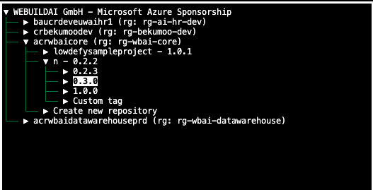

# acr-push-tui

Textual TUI for building and pushing Docker images to Azure Container Registry.



## Setup

Install dependencies with uv:

```
uv sync
```

Install globally (choose one):

```
pipx install -e .
```

```
uv tool install .
```

```
pip install --user .
```

Run the TUI:

```
acr-push-tui run
```

Run CI mode:

```
acr-push-tui run --ci --acr <name> --rg <group> --repo <repo> --tag <tag> --dockerfile <path> --context <dir>
```

## Environment Variables

Settings can be provided via environment variables with the `ACR_PUSH_` prefix.

- **Interactive TUI mode**: you can leave these unset and choose values in the UI.
- **CI mode (`--ci`)**: the app **requires** all fields marked “Required in CI mode” below
  (either via CLI flags or these environment variables). Missing values fail fast.

Supported variables (see `.env.example` for a copy/paste template):

- **Required in CI mode**
  - `ACR_PUSH_ACR_NAME`
  - `ACR_PUSH_ACR_RESOURCE_GROUP`
  - `ACR_PUSH_REPO_NAME`
  - `ACR_PUSH_TAG`
  - `ACR_PUSH_DOCKERFILE_PATH`
  - `ACR_PUSH_BUILD_CONTEXT`

- **Optional**
  - `ACR_PUSH_SKIP_LATEST` (default: `false`)
  - `ACR_PUSH_PLATFORM` (default: unset)
  - `ACR_PUSH_LOG_LEVEL` (default: `INFO`)

## Documentation

Detailed usage is in `docs/usage.md`.
